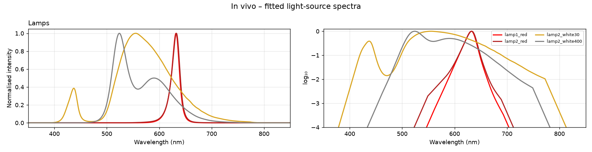

# In vivo

Lamps of the in vivo setup, measured by Jocelyn on 2026-03-31. One spectrum per lamp, at
maximum intensity (the least noisy measurement). Raw traces are in `raw_data/<id>/`,
power-meter files in `spectra/<id>.csv` and plots in `plots/<id>.png`; see
[`light_sources.toml`](light_sources.toml).

## Spectra

| Lamp | Spectrum |
|---|---|
| Lamp1 red | `lamp1_red` |
| Lamp2 red | `lamp2_red` |
| Lamp2 white 30 | `lamp2_white30` |
| Lamp2 white 400 | `lamp2_white400` |

The measurements at lower intensities (0–75 %) are in the git history (commit `7f19aed`).
