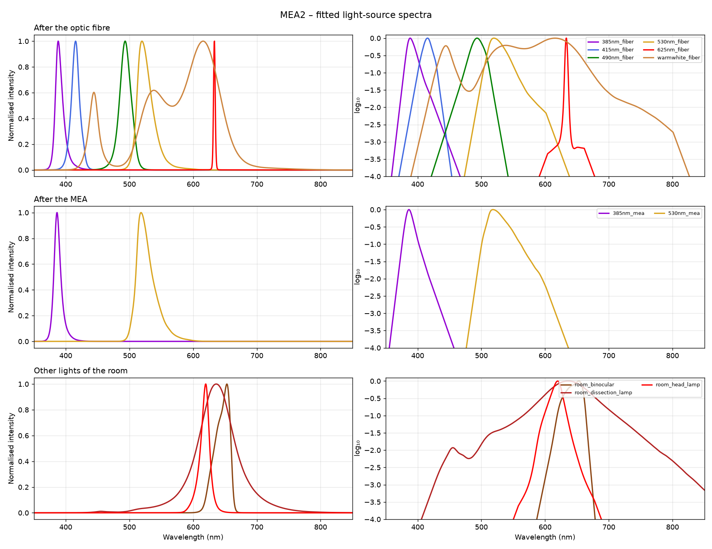

# MEA2

Spectra measured by Awen. The files have no header, so the measurement date is unknown.
Raw traces are in `raw_data/<id>/`, power-meter files in `spectra/<id>.csv` and plots in
`plots/<id>.png`; see [`light_sources.toml`](light_sources.toml).

## Light sources

LED models and serial numbers are still to be added. The names give the nominal wavelength
of each LED.

## Spectra

| Source | After the optic fibre (max power) | After the MEA |
|---|---|---|
| 385nm | `385nm_fiber` | `385nm_mea` |
| 415nm | `415nm_fiber` | |
| 490nm | `490nm_fiber` | |
| 530nm | `530nm_fiber` | `530nm_mea` |
| 625nm | `625nm_fiber` | |
| WarmWhite | `warmwhite_fiber` | |

The after-MEA spectra are Awen's "filtered" violet and yellow measurements.

Other lights of the room: `room_binocular`, `room_dissection_lamp`, `room_head_lamp`.

### To check

- `625nm_fiber` is only ~2 nm wide, peaking at 633 nm: this is not the spectrum of a 625 nm
  LED (~15–20 nm wide) but looks like a laser (HeNe, 632.8 nm) or a very narrow filter.
- `warmwhite_fiber` has a strong blue pump peak at 445 nm (60 % of the maximum), more like a
  cool or neutral white LED than a warm white.
