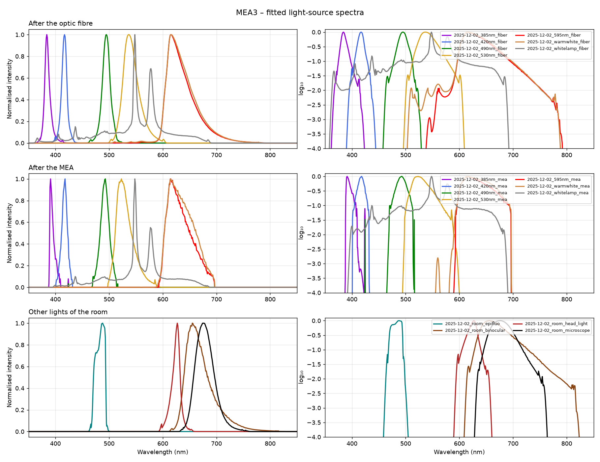

# MEA3

## Light sources

Listed in [`light_sources.toml`](light_sources.toml).

| Name | LED | Serial number |
|---|---|---|
| 385nm | M385L3 | M00797533 |
| 420nm | M420L3 | M00428321 |
| 490nm | M490L4 | M00799946 |
| 530nm | M530L4 | M00798695 |
| 595nm | M595L4 | M01276863 |
| WarmWhite | MWWHLP2 | M01277752 |
| WhiteLamp | | |
| Epifluo Lamp | | |
| RedBinocular | | |
| Headlight | | |
| MicroscopeRed | | |

Before the optic fibre, the LEDs go through a series of filters (to be documented).

## Spectra

Raw traces are in `spectra/raw/<id>/`, power-meter files in `spectra/powermeter/<id>.csv` and
plots in `plots/<id>.png`.

| Source | After the optic fibre | After the MEA |
|---|---|---|
| 385nm | `2025-12-02_385nm_fiber` | `2025-12-02_385nm_mea` |
| 420nm | `2025-12-02_420nm_fiber` | `2025-12-02_420nm_mea` |
| 490nm | `2025-12-02_490nm_fiber` | `2025-12-02_490nm_mea` |
| 530nm | `2025-12-02_530nm_fiber` ⚠ saturated | `2025-12-02_530nm_mea` |
| 595nm | `2025-12-02_595nm_fiber` | `2025-12-02_595nm_mea` |
| WarmWhite | `2025-12-02_warmwhite_fiber` | `2025-12-02_warmwhite_mea` |
| WhiteLamp | `2025-12-02_whitelamp_fiber` | `2025-12-02_whitelamp_mea` |

Other lights of the room: `2025-12-02_room_epifluo`, `_binocular`, `_head_light`, `_microscope`.

### Caveats

- ⚠ **Saturated**: the spectrometer reached its plateau, so the peak is flattened and the
  normalised spectrum overestimates the tails. It should be re-measured with a shorter
  integration time or an ND filter.
- The after-MEA measurements are dim (1–3k counts peak for 385, 420, 490 and 595 nm,
  against ~55k at the fibre). The 150-count noise threshold therefore cuts them at about
  5–10 % of the peak, so their tails are lost.
- The spectrometer clock is wrong (files are dated 2010). The dates come from the folder names
  of the original measurements.
