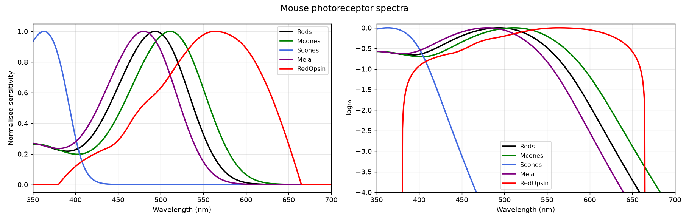

# Photoreceptors

Mouse photoreceptor spectral sensitivities (`spectra/<PR>.csv`, `wavelength_nm,sensitivity`),
350–700 nm in 0.5 nm steps, normalised to 1 at the peak.

- **Rods, Mcones, Scones, Mela**: Govardovskii A1 template (Govardovskii et al. 2000, *In search
  of the visual pigment template*, Visual Neuroscience 17, 509–528), fitted on measured
  photoreceptor spectra. λmax in `spectra/lambda_max.csv`.
- **RedOpsin**: measured spectrum.

Rods and Mcones are the exact spectra used for the OSS theoretical surfaces.

Measured spectra (`source/`): Fred Rieke's lab (University of Washington), public GitHub
repository.

Rebuild with `python -m datasetups.build_photoreceptors`.
